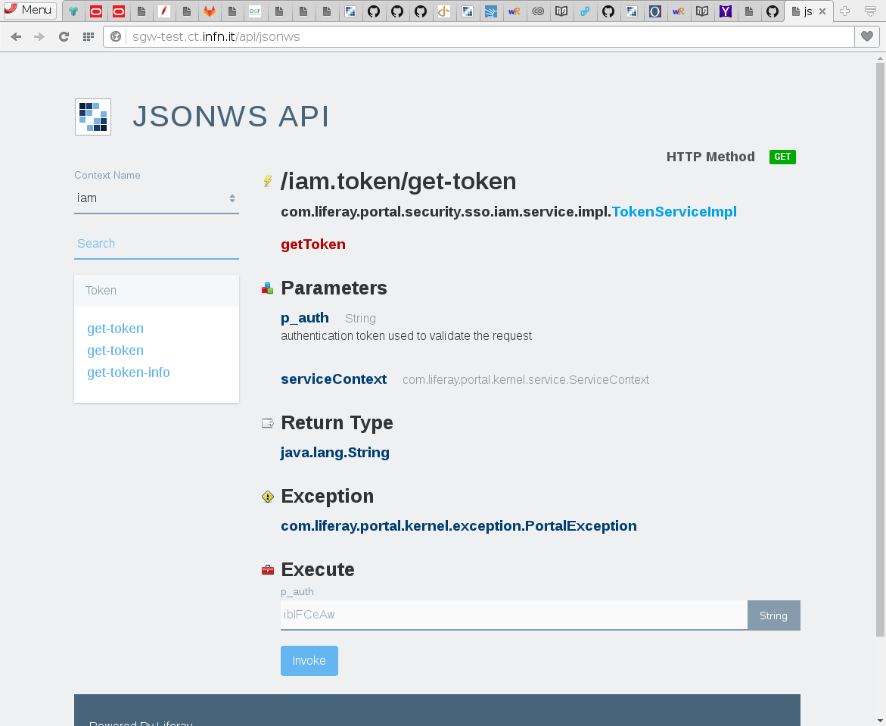

# Developer Guide

Science Gateway developers should use the IAM token to interact with all the services provided by
INDIGO-DATACLOUD. The token is released to Liferay during the authentication and made available to
any application running on the portal. Developer can access the token using the remote interface
generated by the Liferay service builder. Using this interface the portal generate a new service accessible
from the *Java* code and a HTTP APIs using json as data format.

All the remote services are visible in the page `/api/jsonws`. If the modules are deployed,
a new set of APIs with context *iam* is made available as shown in the following picture:

All the users can access the method *get-token* without parameter, as described on the page and explained in
[Liferay documentation] [lifedoc]. The method will return a valid access token of the user.
It will be updated using the refresh token if the remaining validity is under three minutes.

The other *get-token* method allows to retrieve the token for any user providing the `userId`.
Only administrator and authorised services can use this method.

Finally, the method *get-token-info* allows to verify the validity of a token. This method can
be used by an application connected to Liferay in order to verify the validity of the token
and retrieve some information like the user groups or the subject. Only administrator
and authorised user can use this method so in case of applications these have to be associated with
Liferay accounts authorised for this operation and the invocation has to be in the context of these accounts.

[lifedoc]: https://dev.liferay.com/develop/tutorials/-/knowledge_base/7-0/invoking-remote-services
